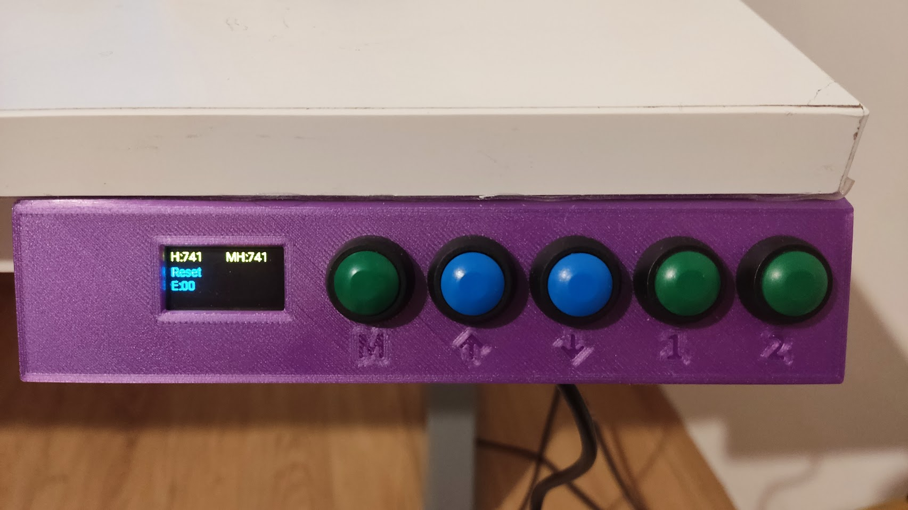
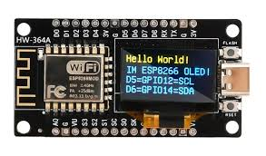
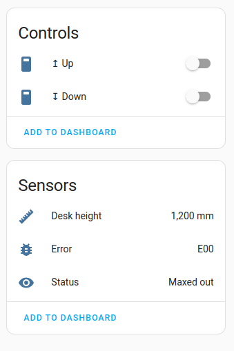

This is an ESPHome component for controlling a lifting desk of an unknown model.
======

Story
======
Some time ago I picked up a used frame of a lifting desk with broken electronics. Quick research revealed that it didn't seem to be any of the known models that you can read about here for example https://community.home-assistant.io/t/desky-standing-desk-esphome-works-with-desky-uplift-jiecang-assmann-others/383790 

The problem was the the control panel didn't turn on every time. In fact, you had to plug and unplug it a hundred times
for it to finally come alive. Physically it seemed ok and I didn't have enough expertise in electronics to investigate
it further, so I connected a logic analyzer, managed to turn it on and recorded some bytes that I later used to put
this component together. I've also sketched a case that can be 3D printed.

[Some pictures of it](pic/pics.md)

Final product
======

Hardware
======
The component assumes that you use it with a popular ESP8266 NodeMCU module with a 0.96 inch display that looks like this:

Case is 3D printed, buttons are also a popular model than can be bought easily.

Case
======
[STL file](cad/ufo_desk_case.stl)

Model is here: 
https://cad.onshape.com/documents/45d78cc525e092aee55fb095/w/e9f9bd97a05b0db866f06647/e/74652b7a18d69035dbb2d360

Home Assistant
======
Since Home Assistant support is basically free in ESPHome I've exposed a couple of things just to 
give it a try. There is more that can be done, but I don't actually use it, so maybe later.

